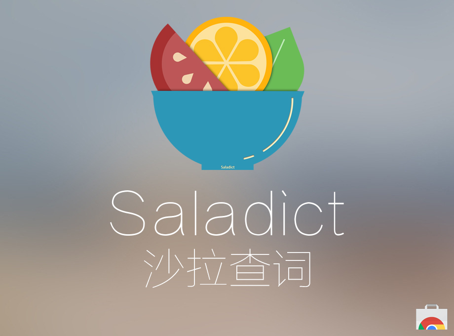
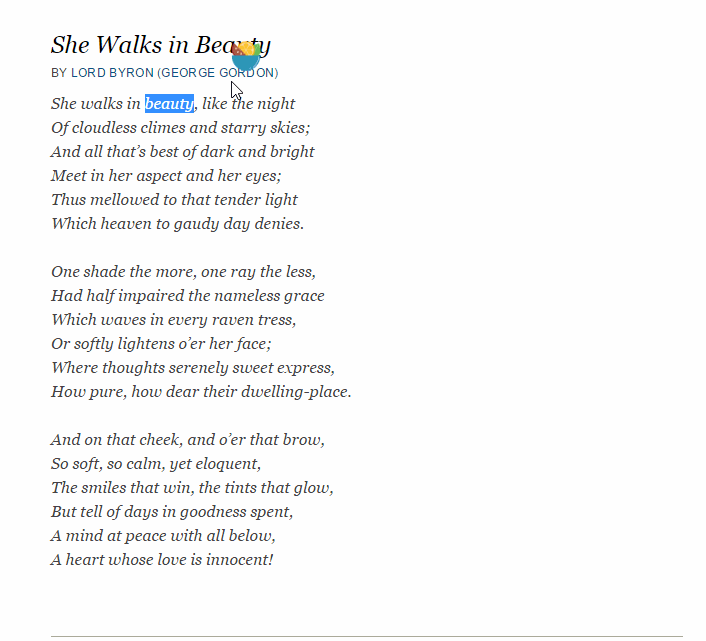

# Saladict 沙拉查词5

Chrome 浏览器插件，网页划词翻译。

<p align="center">
  <a href="https://chrome.google.com/webstore/detail/cdonnmffkdaoajfknoeeecmchibpmkmg" target="_blank"></a>
</p>

[功能一览：](https://github.com/crimx/crx-saladict/wiki)

- [多词典支持，英汉、英英、俚语、词源、权威例句、汉语（繁简）、释义分布图、谷歌翻译](https://github.com/crimx/crx-saladict/wiki#dicts)
- [支持四种划词方式，支持 iframe 划词](https://github.com/crimx/crx-saladict/wiki#mode)
- [支持谷歌和有道分级网页翻译](https://github.com/crimx/crx-saladict/wiki#page-trans)
- [查词面板可钉住可拖动可输入](https://github.com/crimx/crx-saladict/wiki#pin)
- [支持自动发音](https://github.com/crimx/crx-saladict/wiki#autopron)
- [支持添加生词与记录查词历史](https://github.com/crimx/crx-saladict/wiki#search-history)
- [支持 PDF 划词](https://github.com/crimx/crx-saladict/wiki#pdf)
- [各个词典面板支持个性化调整](https://github.com/crimx/crx-saladict/wiki#dict-settings)
- [三按 ctrl 快速查词](https://github.com/crimx/crx-saladict/wiki#triple-ctrl)
- [点击图标快速查词](https://github.com/crimx/crx-saladict/wiki#popup-icon)
- [查词结果支持导出图片](https://github.com/crimx/crx-saladict/wiki#save-img)
- [可显示当前页面二维码](https://github.com/crimx/crx-saladict/wiki#qrcode)
- [右键并支持更多词典页面直达](https://github.com/crimx/crx-saladict/wiki#context-menus)

理论上支持所有 Chrome 系浏览器。效果图：

<p align="center">
  <a href="https://chrome.google.com/webstore/detail/cdonnmffkdaoajfknoeeecmchibpmkmg" target="_blank"></a>
</p>

# 用户评价

> “我用过的最好的查词插件，UI美观大方，查词功能也很强，还有多词源对照，真的很棒！身边同学已经全被我安利换成这个插件了。就目前来说还是有些难以找到*比*这款优秀的查词插件。”

> “非常好用，支持快速查词和划词查询，而且可以添加多个翻译工具。”

> “查词很快，重要的是多个词典对照，还有urban dictionary~ 赞”

> “好喜欢这个软件，界面设计的美观，查询源也丰富”

> “很满意，速度非常快，该有的都有，简洁全面！”

> “非常棒啊，就是这种不用别的操作的词典”

> “哎哟，不错哦！小巧，方便，够用！”

> “只有一个棒字可以形容！！！”

# 下载

- Chrome Web Store: <https://chrome.google.com/webstore/detail/cdonnmffkdaoajfknoeeecmchibpmkmg>
- crx: <https://github.com/crimx/crx-saladict/releases/>

为什么需要这些权限：
- 划词需要访问网页数据
- 快速查词会直接搜索剪贴板文字

除此以外本扩展不收集任何资料，第三方下载请注意对比扩展 ID `cdonnmffkdaoajfknoeeecmchibpmkmg`。

<p align="center">
  <a href="https://chrome.google.com/webstore/detail/cdonnmffkdaoajfknoeeecmchibpmkmg" target="_blank"></a>
</p>

# 更新

【5.29.2】
1. 单词记录同时保存上下文和来源
2. 可编辑单词记录，可添加翻译和注释笔记
3. 可自定义导出模板
4. 扩大了容量（新权限申请）

查看[更新历史](./CHANGELOG.md)。

# 支持开发

觉得好用的话欢迎给作者买杯咖啡支持开发哦~♥

<div align="center">
  
  
</div>

# 开发

添加词典很简单，以 bing 为例

Clone 库并 `$ yarn install`

## 注册词典

`src/app-config.js` 在 `dicts/all` 注册词典并添加相关设置。

```javascript
{
  dicts: {
    all: {
      // ...
      bing: {
        id: 'bing',
        page: 'https://cn.bing.com/dict/search?q=%s',
        preferredHeight: 160,
        showWhenLang: {
          eng: true,
          chs: true
        },
        options: {
          tense: true,
          phsym: true,
          cdef: true
        }
      }
      // ...
    }
  }
}
```

- `id` 为每个词典的标识符；
- `page`为点击标题是跳转的链接，`%s`会替换成关键字，`%z`会替换成繁体字；
- `preferredHeight` 为词典默认高度，超过默认高度的内容会先隐藏起来并显示下箭头；
- `showWhenLang` 配置词典在查词包含某种语言时显示，一般默认为 `true`；
- 词典本身的设置放在 `options` 下，只能是 `boolean` 或者 `number`，会自动在设置页面生成相应选项。
- 如果词典支持发音，在 `autopron` 下补上即可注册自动发音选项（需要在 engine 中判断+实现）。

## 添加模块

在 `src/dictionaries/` 下以词典 id 命名新建文件夹，放置以下文件（可从其它词典复制过来修改），如 bing：

```
bing
├─ favicon.png
├─ _locales.json
├─ engine.js
└─ view.vue
```

- favicon.png 为 32×32 图片；
- _locales.json 中添加多语言，`name` 为词典名，`options` 下为自定义的设置；
- engine.js 负责抓取结果，输出一个函数，返回一个 Promise 包含自定义的结果，最终会被传到 view.vue 上作为 `result` props；
  ```javascript
  /**
  * Search text and give back result
  * @param {string} text - Search text
  * @param {object} config - app config
  * @param {object} helpers - helper functions
  * @returns {Promise} A promise with the result, which will be passed to view.vue as `result` props
  */
  export default function search (text, config, {AUDIO}) {
    return new Promise((resolve, reject) => {
      // ...
    })
  }
  ```
- view.vue 负责渲染结果，如 bing；
  ```html
  <template>
  <section>
    <div class="bing-result" v-if="result">
      <!-- content -->
    </div>
  </section>
  </template>

  <script>
  export default {
    name: 'Bing',
    props: ['result']
  }
  </script>

  <style scoped>
  .bing-result {
    padding: 10px;
  }
  </style>
  ```

具体使用可参考其它词典。
