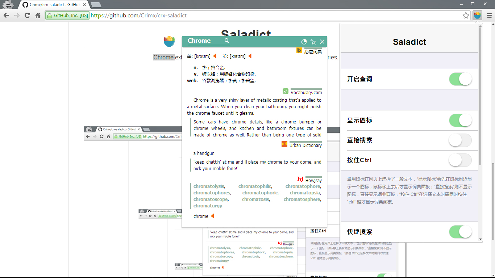

# Saladict 沙拉查词5

Chrome 浏览器插件，网页划词翻译。

<p align="center">
  <a href="https://chrome.google.com/webstore/detail/cdonnmffkdaoajfknoeeecmchibpmkmg" target="_blank"></a>
</p>

[功能一览：](https://github.com/crimx/crx-saladict/wiki)

- [多词典支持，英汉、英英、俚语、词源、权威例句、汉语、释义分布图、谷歌翻译**全包**](https://github.com/crimx/crx-saladict/wiki#%E5%A4%9A%E8%AF%8D%E5%85%B8%E6%94%AF%E6%8C%81%E8%8B%B1%E6%B1%89%E8%8B%B1%E8%8B%B1%E4%BF%9A%E8%AF%AD%E8%AF%8D%E6%BA%90%E6%9D%83%E5%A8%81%E4%BE%8B%E5%8F%A5%E6%B1%89%E8%AF%AD%E9%87%8A%E4%B9%89%E5%88%86%E5%B8%83%E5%9B%BE%E8%B0%B7%E6%AD%8C%E7%BF%BB%E8%AF%91)
- [支持**四种**划词方式，支持 iframe 划词](https://github.com/crimx/crx-saladict/wiki#%E6%94%AF%E6%8C%81%E5%9B%9B%E7%A7%8D%E5%88%92%E8%AF%8D%E6%96%B9%E5%BC%8F%E6%94%AF%E6%8C%81-iframe-%E5%88%92%E8%AF%8D)
- [支持 **PDF** 划词](https://github.com/crimx/crx-saladict/wiki#%E6%94%AF%E6%8C%81-pdf-%E5%88%92%E8%AF%8D)
- [支持三按 ctrl 快速查词](https://github.com/crimx/crx-saladict/wiki#%E6%94%AF%E6%8C%81%E4%B8%89%E6%8C%89-ctrl-%E5%BF%AB%E9%80%9F%E6%9F%A5%E8%AF%8D)
- [也可以点击图标快速查词](https://github.com/crimx/crx-saladict/wiki#%E7%82%B9%E5%87%BB%E5%9B%BE%E6%A0%87%E5%BF%AB%E9%80%9F%E6%9F%A5%E8%AF%8D)
- [右键支持**谷歌网页翻译**，支持更多词典页面直达](https://github.com/crimx/crx-saladict/wiki#%E5%8F%B3%E9%94%AE%E6%94%AF%E6%8C%81%E8%B0%B7%E6%AD%8C%E7%BD%91%E9%A1%B5%E7%BF%BB%E8%AF%91%E6%94%AF%E6%8C%81%E6%9B%B4%E5%A4%9A%E8%AF%8D%E5%85%B8%E9%A1%B5%E9%9D%A2%E7%9B%B4%E8%BE%BE)
- [各个词典面板支持个性化调整](https://github.com/crimx/crx-saladict/wiki#%E5%90%84%E4%B8%AA%E8%AF%8D%E5%85%B8%E9%9D%A2%E6%9D%BF%E6%94%AF%E6%8C%81%E4%B8%AA%E6%80%A7%E5%8C%96%E8%B0%83%E6%95%B4)
- [查词面板可钉住可拖动可输入](https://github.com/crimx/crx-saladict/wiki#%E6%9F%A5%E8%AF%8D%E9%9D%A2%E6%9D%BF%E5%8F%AF%E9%92%89%E4%BD%8F%E5%8F%AF%E6%8B%96%E5%8A%A8%E5%8F%AF%E8%BE%93%E5%85%A5)
- [查词结果支持**导出图片**](https://github.com/crimx/crx-saladict/wiki#%E6%9F%A5%E8%AF%8D%E7%BB%93%E6%9E%9C%E6%94%AF%E6%8C%81%E5%AF%BC%E5%87%BA%E5%9B%BE%E7%89%87)
- [可显示当前页面二维码](https://github.com/crimx/crx-saladict/wiki#%E5%8F%AF%E6%98%BE%E7%A4%BA%E5%BD%93%E5%89%8D%E9%A1%B5%E9%9D%A2%E4%BA%8C%E7%BB%B4%E7%A0%81)

理论上支持所有 Chrome 系浏览器。效果图：

<p align="center">
  <a href="https://chrome.google.com/webstore/detail/cdonnmffkdaoajfknoeeecmchibpmkmg" target="_blank"></a>
</p>

# 用户评价

> “我用过的最好的查词插件，UI美观大方，查词功能也很强，还有多词源对照，真的很棒！身边同学已经全被我安利换成这个插件了。就目前来说还是有些难以找到*比*这款优秀的查词插件。”

> “非常好用，支持快速查词和划词查询，而且可以添加多个翻译工具。”

> “查词很快，重要的是多个词典对照，还有urban dictionary~ 赞”

> “好喜欢这个软件，界面设计的美观，查询源也丰富”

> “很满意，速度非常快，该有的都有，简洁全面！”

> “非常棒啊，就是这种不用别的操作的词典”

> “哎哟，不错哦！小巧，方便，够用！”

> “只有一个棒字可以形容！！！”

# 下载

- Chrome Web Store: <https://chrome.google.com/webstore/detail/cdonnmffkdaoajfknoeeecmchibpmkmg>
- crx: <https://github.com/crimx/crx-saladict/releases/>

为什么需要这些权限：
- 划词需要访问网页数据
- 快速查词会直接搜索剪贴板文字

除此以外本扩展不收集任何资料，第三方下载请注意对比扩展 ID `cdonnmffkdaoajfknoeeecmchibpmkmg`。

<p align="center">
  <a href="https://chrome.google.com/webstore/detail/cdonnmffkdaoajfknoeeecmchibpmkmg" target="_blank"></a>
</p>

# 更新

【5.16.1】
1. 添加 PDF 支持！
2. 克服懒癌撰写了[使用说明](https://github.com/crimx/crx-saladict/wiki)
3. 修复通知框点击

查看[更新历史](./CHANGELOG.md)。

# 开发

添加词典很简单，以 bing 为例

Clone 库并 `$ npm install`

## 注册词典

`src/app-config.js` 在 `dicts/all` 注册词典并添加相关设置。

```javascript
{
  dicts: {
    all: {
      // ...
      bing: {
        id: 'bing',
        page: 'https://cn.bing.com/dict/search?q=%s',
        preferredHeight: 160,
        showWhenLang: {
          eng: true,
          chs: true
        },
        options: {
          tense: true,
          phsym: true,
          cdef: true
        }
      }
      // ...
    }
  }
}
```

- `id` 为每个词典的标识符；
- `page`为点击标题是跳转的链接，`%s`会替换成关键字，`%z`会替换成繁体字；
- `preferredHeight` 为词典默认高度，超过默认高度的内容会先隐藏起来并显示下箭头；
- `showWhenLang` 配置词典在查词包含某种语言时显示，一般默认为 `true`；
- 词典本身的设置放在 `options` 下，只能是 `boolean` 或者 `number`，会自动在设置页面生成相应选项。

## 添加模块

在 `src/dictionaries/` 下以词典 id 命名新建文件夹，放置以下文件（可从其它词典复制过来修改），如 bing：

```
bing
├─ favicon.png
├─ _locales.json
├─ engine.js
└─ view.vue
```

- favicon.png 为 32×32 图片；
- _locales.json 中添加多语言，`name` 为词典名，`options` 下为自定义的设置；
- engine.js 负责抓取结果，输出一个函数，返回一个 Promise 包含自定义的结果，最终会被传到 view.vue 上作为 `result` props；
  ```javascript
  /**
  * Search text and give back result
  * @param {string} text - Search text
  * @param {object} config - app config
  * @returns {Promise} A promise with the result, which will be passed to view.vue as `result` props
  */
  export default function search (text, config) {
    return new Promise((resolve, reject) => {
      // ...
    })
  }
  ```
- view.vue 负责渲染结果，如 bing；
  ```html
  <template>
  <section>
    <div class="bing-result" v-if="result">
      <!-- content -->
    </div>
  </section>
  </template>

  <script>
  export default {
    name: 'Bing',
    props: ['result']
  }
  </script>

  <style scoped>
  .bing-result {
    padding: 10px;
  }
  </style>
  ```

具体使用可参考其它词典。
